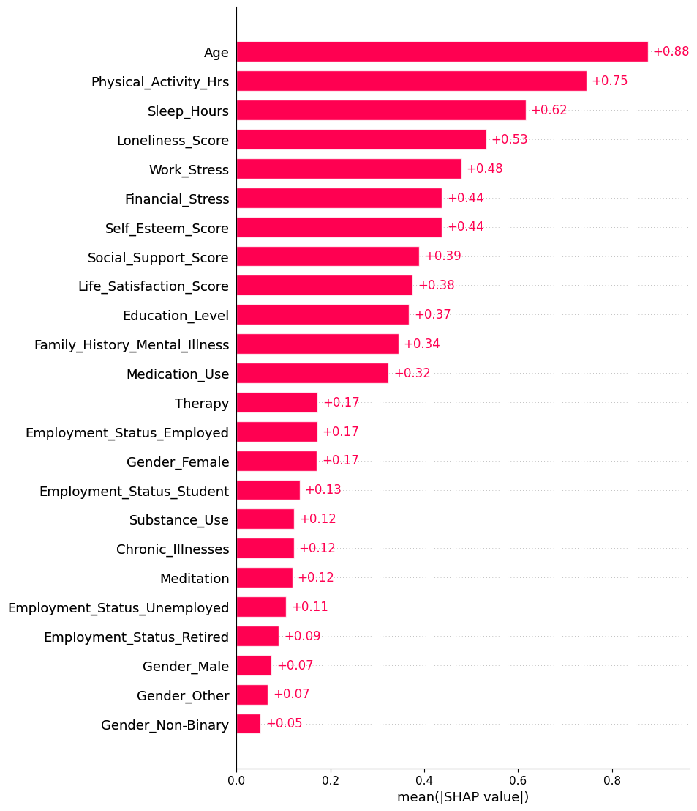

팀원들: 

 * 박문길 경영학과 jinyu@hanyang.ac.kr

 * 진이 무용학과 chenyi20020923@gmail.com
       
 * 장범 영어영문학과 zhangfan20000408@163.com
       
 * 증자서 인공지능학과 zzxzzx1818@163.com
       
# I.제안 Proposal

우리는 옵션 1을 선택했습니다

## 동기 Motivation

최근 몇 년 사이, 불안 장애와 우울증으로 인한 자살 사례가 뉴스 보도를 통해 빈번하게 접할 수 있을 만큼 사회적으로 큰 문제가 되고 있습니다. 
    
실제로 일상생활 속에서도 정신건강에 이상을 겪는 사람들이 점점 증가하고 있으며, 제 주변만 하더라도 다섯 명 중 한 명꼴로 불안 또는 우울 증세를 경험하고 있으며, 일부는 입원 치료가 필요한 수준에까지 이르고 있는 실정입니다.

이러한 현실은 단순한 개인의 문제가 아니라 사회 전반에 걸친 중대한 공중보건 문제로 인식되어야 하며, 조기 발견과 체계적인 대응이 절실합니다. 

이에 본 연구는 인공지능(AI) 기술을 활용하여 개인의 불안 및 우울 수준을 예측하고, 그에 따른 조기 개입 및 예방의 가능성을 탐색하는 것을 목적으로 하고 있습니다.

특히, AI 기반 예측 모델을 통해 정신건강 고위험군을 조기에 식별함으로써 전문적인 치료나 상담으로의 연계 가능성을 높이고, 나아가 개인의 삶의 질 향상과 사회적 비용 절감에도 기여할 수 있을 것으로 기대됩니다. 

본 과제를 통해 우리는 정신건강 문제의 현황을 보다 객관적이고 정량적으로 분석하고, 그 원인과 패턴을 규명하여 보다 효과적인 해결책을 제시하고자 합니다.

이러한 시도는 단순한 기술적 구현을 넘어, 인간 중심의 기술 활용이라는 측면에서 매우 중요한 의의를 지니며, 미래 정신건강 관리의 새로운 패러다임을 제시하는 데 기여할 것입니다.

## 우리의 기대 Our expectations

본 연구를 통해 우리는 단순히 불안과 우울증의 수준을 예측하는 것을 넘어, 정신건강 문제에 대한 보다 깊이 있는 이해를 얻고자 합니다. 첫째, 

AI 기술을 활용한 예측 모델이 실제로 정신건강 관리에 어떻게 긍정적인 영향을 미칠 수 있는지에 대한 실질적인 증거를 제공하고자 합니다. 

또한, AI 모델을 통해 실시간으로 불안과 우울증 증세를 추적하고 분석함으로써, 정신건강 문제가 발생할 위험이 있는 사람들을 조기에 발견하고 대응할 수 있는 시스템을 마련하는 것이 우리의 목표입니다.

# II.데이터셋 Datasets

이것은 우리 프로젝트에서 사용한 데이터셋 링크입니다:
[https://www.kaggle.com/datasets/ak0212/anxiety-and-depression-mental-health-factors](https://www.kaggle.com/datasets/ak0212/anxiety-and-depression-mental-health-factors)

먼저, CSV 파일을 읽고 pandas를 사용하여 데이터셋을 확인해 봅시다:

   ```python
   import pandas as pd
   df = pd.read_csv("anxiety_depression_data.csv")
   print(df.info())
   ```

터미널에서 아래와 같은 출력 결과를 얻을 수 있습니다:

```python
   <class 'pandas.core.frame.DataFrame'>
   RangeIndex: 1200 entries, 0 to 1199
   Data columns (total 21 columns):
    #   Column                         Non-Null Count  Dtype
   ---  ------                         --------------  -----
    0   Age                            1200 non-null   int64
    1   Gender                         1200 non-null   object
    2   Education_Level                1200 non-null   object
    3   Employment_Status              1200 non-null   object
    4   Sleep_Hours                    1200 non-null   float64
    5   Physical_Activity_Hrs          1200 non-null   float64
    6   Social_Support_Score           1200 non-null   int64
    7   Anxiety_Score                  1200 non-null   int64
    8   Depression_Score               1200 non-null   int64
    9   Stress_Level                   1200 non-null   int64
    10  Family_History_Mental_Illness  1200 non-null   int64
    11  Chronic_Illnesses              1200 non-null   int64
    12  Medication_Use                 453 non-null    object
    13  Therapy                        1200 non-null   int64
    14  Meditation                     1200 non-null   int64
    15  Substance_Use                  366 non-null    object
    16  Financial_Stress               1200 non-null   int64
    17  Work_Stress                    1200 non-null   int64
    18  Self_Esteem_Score              1200 non-null   int64
    19  Life_Satisfaction_Score        1200 non-null   int64
    20  Loneliness_Score               1200 non-null   int64
   dtypes: float64(2), int64(14), object(5)
   memory usage: 197.0+ KB
   ```

각 열의 요약된 정보는 다음과 같습니다:

| 변수명 | 설명 | 유형 | 범위/예시 |
|--------|------|------|----------|
| Age | 응답자 연령 | 수치 | 18-74세 |
| Gender | 성별 | 범주 | 남성, 여성, 논바이너리, 기타 |
| Education_Level | 교육 수준 | 범주 | 고등학교, 학사, 석사, 박사, 기타 |
| Employment_Status | 고용 상태 | 범주 | 취업자, 실업자, 학생, 은퇴자 |
| Sleep_Hours | 일일 수면 시간(시간) | 수치 | 2.0-12.4시간 |
| Physical_Activity_Hrs | 주간 운동 시간(시간) | 수치 | 0.0-15.1시간 |
| Social_Support_Score | 사회적 지지 점수 | 수치 | 1-9(점수가 높을수록 지지가 강해진다) |
| Anxiety_Score | 불안 증상 점수 | 수치 | 1-20(점수가 높을수록 증상이 심해진다) |
| Depression_Score | 우울 증상 점수 | 수치 | 1-20(점수가 높을수록 증상이 심해진다) |
| Stress_Level | 스트레스 수준 | 수치 | 1-9(점수가 높을수록 스트레스가 커진다) |
| Family_History_Mental_Illness | 정신 질환 가족력 | 이분 | 0(없음), 1(있음) |
| Chronic_Illnesses | 만성 질환 | 이분 | 0(없음), 1(있음) |
| Medication_Use | 약물 사용 빈도 | 범주 | 없음, 가끔, 정기적 |
| Therapy | 심리 치료 여부 | 이분 | 0(아니오), 1(예) |
| Meditation | 명상 실천 여부 | 이분 | 0(아니오), 1(예) |
| Substance_Use | 물질 사용 빈도 | 범주 | 없음, 가끔, 빈번함 |
| Financial_Stress | 재정적 스트레스 | 수치 | 1-9(점수가 높을수록 스트레스가 커진다) |
| Work_Stress | 직장 스트레스 | 수치 | 1-9(점수가 높을수록 스트레스가 커진다) |
| Self_Esteem_Score | 자아 존중감 점수 | 수치 | 1-9(점수가 높을수록 자존감이 강해진다) |
| Life_Satisfaction_Score | 삶의 만족도 | 수치 | 1-9(점수가 높을수록 만족도이 높아진다) |
| Loneliness_Score | 외로움 점수 | 수치 | 1-9(점수가 높을수록 외로움이 심해진다) |

# III. 방법론 Methodology

## 전처리 및 특징 엔지니어링 Preprocessing & Feature Engineering

### NaN 값 처리

**Medication_Use** 와 **Substance_Use** 열에 많은 NaN 값이 있는 것을 알 수 있으므로 이를 처리해야 합니다.

   ```python
   df['Medication_Use'] = df['Medication_Use'].fillna('None')
   df['Substance_Use'] = df['Substance_Use'].fillna('None')
   ```

### 특징 인코딩 Feature Encoding

비수치형 값을 가진 몇몇 열이 있습니다

그래서 아래 열들을 전처리하기 위해 원-핫 인코딩(One-Hot Encoding) 과 순서 인코딩(Ordinal Encoding) 을 사용합니다:

원-핫 인코딩（One-hot encoding) (명확한 순서가 없는 범주형 변수의 경우):
| Gender | Employment_Status | Medication_Use | Substance_Use |
|---------|--------------------|-----------------|----------------|
| | | |

순서 인코딩 (명확한 순서가 있는 범주형 변수의 경우):
| Education_Level | Medication_Use | Substance_Use |
|------------------|-----------------|----------------|
| | | |

and here's the code of the encoding process:
다음은 인코딩 과정을 위한 코드입니다:
```python
   df = pd.get_dummies(df,columns=[
    "Gender",
    "Employment_Status",
   ], drop_first=False,dtype=int)
   ```

   ```python
   education_map = {
    "Other": 0,
    "High School": 1,
    "Bachelor's": 2,
    "Master's": 3,
    "PhD": 4
   }
   df["Education_Level"] = df["Education_Level"].map(education_map)

   medication_map = {
    "None": 0,
    "Occasional": 1,
    "Regular": 2
   }
   df["Medication_Use"] = df["Medication_Use"].map(medication_map)
   
   substance_map = {
    "None": 0,
    "Occasional": 1,
    "Frequent": 2
   }
   df["Substance_Use"] = df["Substance_Use"].map(substance_map)
   ```

### 특징 생성 Feature Construction

예측 대상 값을 더 쉽게 만들기 위해,

우리는 **Mental_Distress_Score** 라는 새로운 특징을 생성할 것입니다.

이를 통해 전반적인 심리적 고통 수준을 설명합니다.

**Anxiety_Score**,**Depression_Score** , **Stress_Level**

```python
   df['Mental_Distress_Score'] = df['Anxiety_Score'] + df['Depression_Score'] + df['Stress_Level']
   ```

### 특징 선택 Feature Selection

모델 성능과 해석 가능성을 향상시키기 위해

여러 모델을 사용하여 특징 중요도를 평가하고

예측에 중요한 특징만을 선별하여 유지합니다

추신: 이 단계를 계속 진행하기 위해서

학습 이외의 패키지가 필요합니다,

다음과 같이 설치할 수 있습니다:
   ```python
   pip install xgboost shap scikit-learn matplotlib
   ```

**먼저**：

특징 중요도를 결정하기 위해 **XGBoost**를 사용합니다

```python
   import numpy as np
   import xgboost as xgb
   import shap
   import matplotlib.pyplot as plt
   from sklearn.model_selection import train_test_split
   from sklearn.metrics import mean_squared_error, r2_score

   # 대상 열과 다른 학습 데이터를 별도로 선택합니다.
   X = df.drop(columns=['Mental_Distress_Score','Anxiety_Score','Depression_Score','Stress_Level'])
   y = df['Mental_Distress_Score']

   # 데이터 분할
   X_train, X_test, y_train, y_test = train_test_split(X, y, test_size=0.2, random_state=42)

   # 모델 학습
   model = xgb.XGBRegressor(
    n_estimators=100,
    max_depth=4,
    learning_rate=0.1,
    subsample=0.8,
    random_state=42
   )
   model.fit(X_train, y_train)

   # 모델 평가
   y_pred = model.predict(X_test)
   mse = mean_squared_error(y_test, y_pred)
   rmse = np.sqrt(mse)
   r2 = r2_score(y_test, y_pred)
   print(f"RMSE: {rmse:.2f}")
   print(f"R² Score: {r2:.3f}")

   # 설명자 초기화
   explainer = shap.Explainer(model, X_train)

   # SHAP 값 얻기
   shap_values = explainer(X_train)

   # 기능 중요도 표시
   shap.plots.bar(shap_values, max_display=25)
   ```



비록 **Gender_Male**, **Gender_Other**,그리고 **Gender_Non-Binary** 

비교적 낮은 SHAP 값을 받았지만, 우리는 이를 제거하지 않기로 결정했습니다

왜냐하면 이들은 동일한 범주형 특징에서 비롯되었기 때문입니다

하지만 이 특징 내 일부 범주는 비교적 높은 중요도를 보였습니다

### 표준화 Standardization

우리는 학습의 SVR 모델을 사용하고 있습니다

SVM은 서로 다른 특징 스케일에 매우 민감하기 때문입니다

따라서 데이터의 표준화가 필요합니다

   ```python
   from sklearn.preprocessing import StandardScaler

   # 대상 열과 정렬된 코드화된 열을 명확하게 정의합니다(표준화 없이)
   target_cols = ['Mental_Distress_Score', 'Anxiety_Score', 'Depression_Score', 'Stress_Level']
   encoded_ordered_cols = ['Education_Level', 'Medication_Use', 'Substance_Use']

   # 모든 숫자 열
   numeric_cols = df.select_dtypes(include='number').columns.tolist()

   # One-Hot 인코딩된 열 식별: 값은 0 또는 1이고 열 이름은 get_dummies에서 가져옵니다.
   possible_one_hot_cols = [col for col in numeric_cols if df[col].nunique() <= 2 and set(df[col].unique()) <= {0, 1}]

   # 표준화할 열 = 대상 제거, 정렬된 인코딩, 원핫 인코딩 열
   standardize_cols = [
       col for col in numeric_cols
       if col not in target_cols + encoded_ordered_cols + possible_one_hot_cols
   ]

   # 표준화 수행
   scaler = StandardScaler()
   df_scaled = df.copy()
   df_scaled[standardize_cols] = scaler.fit_transform(df[standardize_cols])
   ```
### 모델 학습

SVM은 고차원 데이터 처리에 효과적이며,

특히 특징 개수가 샘플 개수보다 훨씬 많을 때에도 안정적으로 작동합니다.

데이터가 2,000개의 행만 있으므로 SVM을 사용합니다.

   ```python
   from sklearn.model_selection import train_test_split, GridSearchCV
   from sklearn.svm import SVR
   from sklearn.metrics import mean_squared_error, r2_score
   import numpy as np

   # 1. 특징과 대상 분리(Mental_Distress_Score를 회귀 대상으로 사용)
   X = df_scaled.drop(columns=['Mental_Distress_Score', 'Anxiety_Score', 'Depression_Score', 'Stress_Level'])
   y = df_scaled['Mental_Distress_Score']

   # 2. 데이터셋 분할
   X_train, X_test, y_train, y_test = train_test_split(X, y, test_size=0.2, random_state=42)

   # 3. 하이퍼파라미터 검색: GridSearchCV를 사용하여 최적의 C 및 감마를 선택합니다.
   param_grid = {
       'C': [0.1, 1, 10],
       'gamma': ['scale', 'auto', 0.01, 0.001],
       'kernel': ['rbf']
   }
   svr = SVR()
   grid_search = GridSearchCV(svr, param_grid, cv=5, scoring='neg_mean_squared_error', verbose=0)
   grid_search.fit(X_train, y_train)

   # 4. 최적의 모델을 사용하여 예측
   best_model = grid_search.best_estimator_
   y_pred = best_model.predict(X_test)

   # 5. 모델 평가
   mse = mean_squared_error(y_test, y_pred)
   rmse = np.sqrt(mse)
   r2 = r2_score(y_test, y_pred)

   print("✅ Best Parameters:", grid_search.best_params_)
   print(f"📉 RMSE: {rmse:.3f}")
   print(f"📈 R² Score: {r2:.3f}")

   ```python
   ✅ Best Parameters: {'C': 0.1, 'gamma': 0.001, 'kernel': 'rbf'}
   📉 RMSE: 8.080
   📈 R² Score: -0.000
   ```
# IV. 관련 연구 Related Work 

다음은 sklearn의 SVM 문서입니다.

[https://scikit-learn.org/stable/modules/svm.html](https://scikit-learn.org/stable/modules/svm.html)
